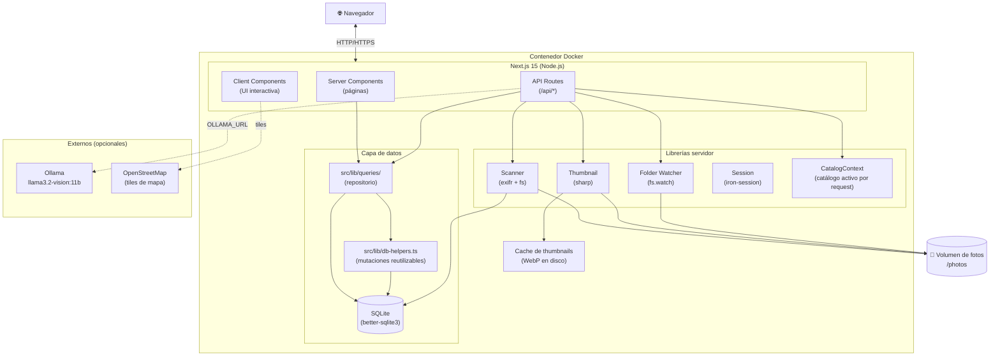
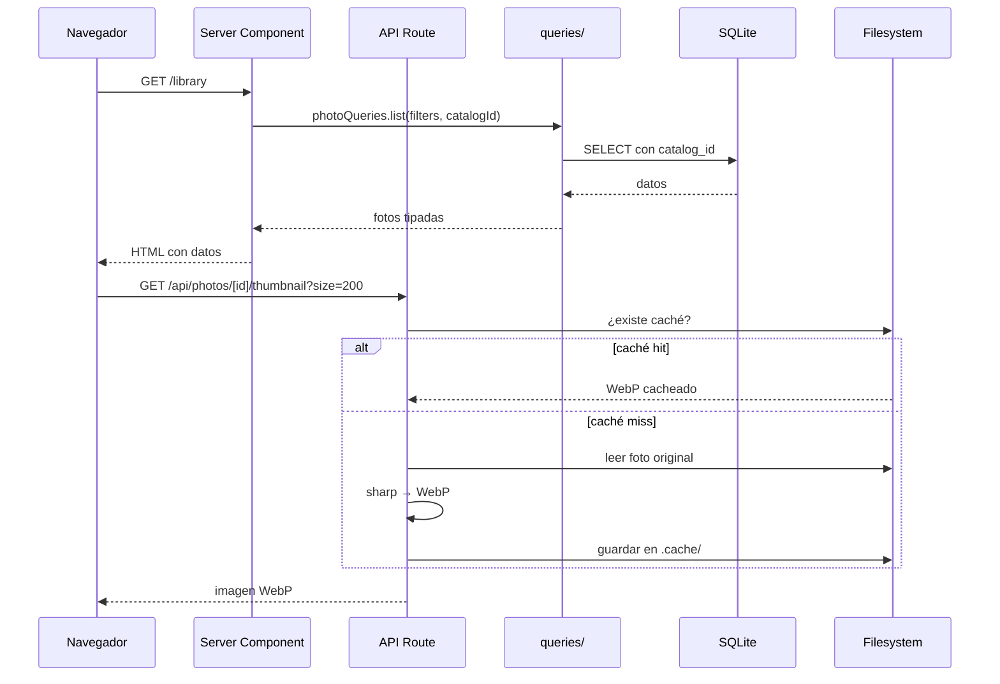
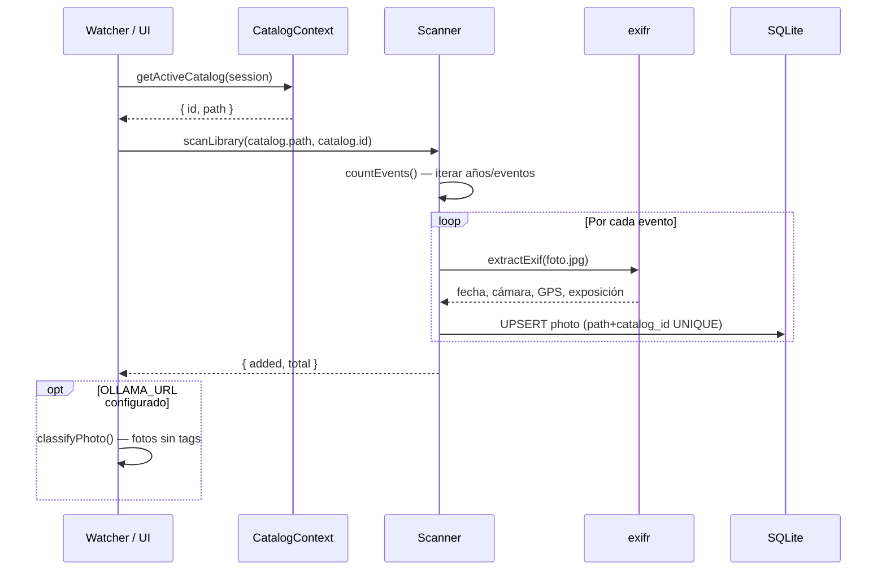

# Arquitectura del sistema

## Visión general

photoshelf es una aplicación web **monolítica** construida con Next.js 15 App Router (React 19). El servidor sirve tanto la interfaz de usuario (React Server Components + Client Components) como la API REST. No hay servicios separados — todo corre en un único proceso Node.js.



## Capas de la aplicación

### 1. Presentación (UI)

- **Server Components**: renderizan HTML inicial con datos de SQLite (via `queries/`)
- **Client Components**: interactividad (formularios, modales, zoom, mapa, swipe gestures)
- **API Routes**: endpoints REST para operaciones desde el cliente

### 2. Capa de repositorio (`src/lib/queries/`)

Creada en US-022. Toda la lógica de acceso a datos vive aquí — ni los Server Components ni los route handlers escriben SQL directamente.

| Módulo | Funciones |
|---|---|
| `photos.ts` | `photoQueries.list`, `photoQueries.get`, `photoQueries.update` |
| `catalogs.ts` | `catalogQueries.list`, `catalogQueries.create`, `catalogQueries.update`, `catalogQueries.delete` |
| `catalog.ts` | `getActiveCatalog`, `switchCatalog` |
| `timeline.ts` | `timelineQueries.periods` |
| `tags.ts` | `tagQueries.list`, `tagQueries.forPhoto` |
| `themes.ts` | `themeQueries.list` |
| `stats.ts` | `statsQueries.summary`, `statsQueries.byYear` |
| `groups.ts` | `groupQueries.list` |
| `sidebar.ts` | Datos agregados para el sidebar |

### 3. Helpers de mutación (`src/lib/db-helpers.ts`)

Creado en US-016. Centraliza las operaciones de escritura reutilizadas en múltiples rutas:

- `upsertAiTags(photoId, tags[])` — DELETE + INSERT de tags IA (antes duplicado en ≥5 archivos)
- `buildPhotoFilter(params)` — construye la cláusula WHERE de fotos (antes duplicado en ≥4 rutas)
- `PHOTOS_PATH` — constante centralizada (antes declarada en ≥7 archivos)

### 4. Lógica de negocio

- **`scanner.ts`**: recorre el filesystem del catálogo activo, extrae EXIF y sincroniza la BD
- **`thumbnail.ts`**: genera y cachea miniaturas WebP con sharp
- **`folderWatcher.ts`**: monitorización de carpetas, debounce, auto-scan y auto-classify
- **`ollama.ts`**: cliente para classify, review, search y generación de proyectos
- **`session.ts`**: autenticación con iron-session
- **`catalog-context.ts`**: resuelve el catálogo activo por request (desde cookie de sesión)

### 5. Datos

- **SQLite** (better-sqlite3): base de datos embebida, WAL mode, claves foráneas activadas
- **Disco**: fotos originales en el directorio del catálogo activo, thumbnails en `/data/.cache`

## Múltiples catálogos (EPIC-001)

Antes de EPIC-001 photoshelf gestionaba un único directorio configurado con `PHOTOS_PATH`. Ahora el modelo es:

1. La tabla `catalogs` almacena N bibliotecas (nombre + ruta).
2. `photos.catalog_id` FK → `catalogs.id` — cada foto pertenece a un catálogo.
3. El componente `CatalogSwitcher` en el sidebar cambia el catálogo activo sin recargar la página.
4. Las rutas `/api/catalogs/` gestionan CRUD de catálogos y el switch del activo.
5. `catalog-context.ts` resuelve el catálogo activo por request (cookie `active_catalog_id`).
6. Todas las queries de `src/lib/queries/` filtran por `catalog_id` de forma transparente.

## Flujo de petición típico



## Proceso de escaneo



## Gestión de estado del servidor

Para operaciones asíncronas de larga duración (escaneo, clasificación), el servidor usa **módulos singleton** con estado en memoria:

```
scanState.ts      → { running, done, total, currentEvent, error }
classifyState.ts  → { running, done, total, year, error }
watcherState.ts   → { enabled, watching, classifying, classifyDone, classifyTotal }
```

El cliente hace polling cada 2 segundos a `/api/scan/status` y `/api/watcher/status` para mostrar el progreso.

## Tests

Cobertura añadida en US-019:

| Fichero | Qué cubre |
|---|---|
| `src/lib/__tests__/config.test.ts` | Lectura y validación de configuración |
| `src/lib/__tests__/scanner.test.ts` | Lógica de escaneo de archivos |
| `src/lib/__tests__/thumbnail.test.ts` | Generación de thumbnails |
| `src/app/api/auth/__tests__/login.test.ts` | Flujo de autenticación |
| `src/__tests__/session.test.ts` | Manejo de sesión |
| `src/__tests__/ollama.test.ts` | Cliente Ollama |
| `src/__tests__/projectFilters.test.ts` | Filtros de proyectos |

## Startup

`src/instrumentation.ts` (hook de Next.js) inicia el `folderWatcher` al arrancar el servidor Node.js, antes de servir cualquier petición.
