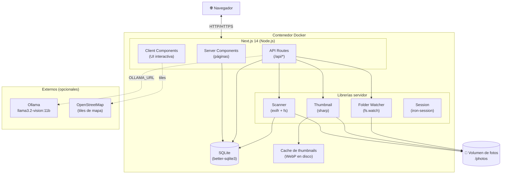
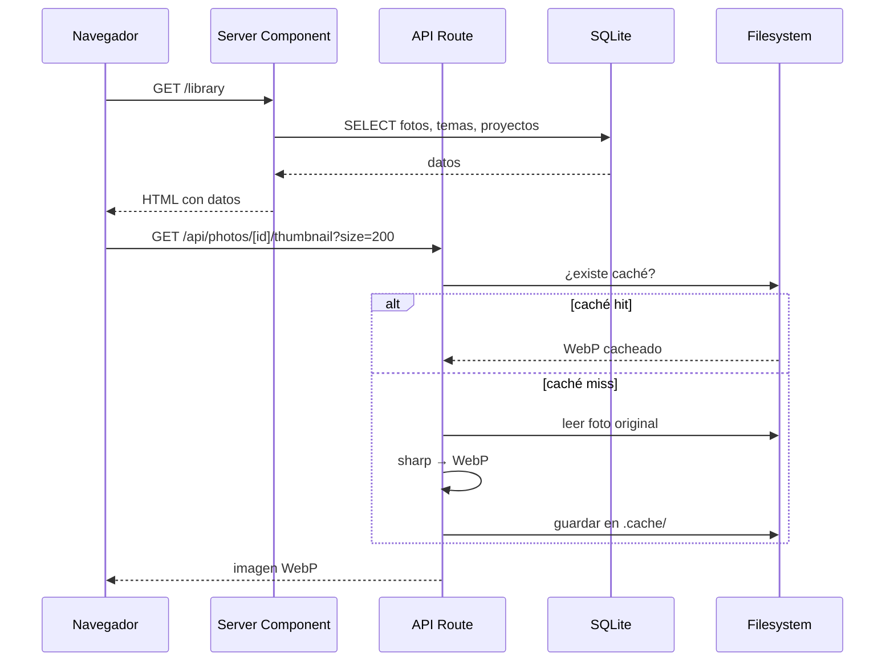
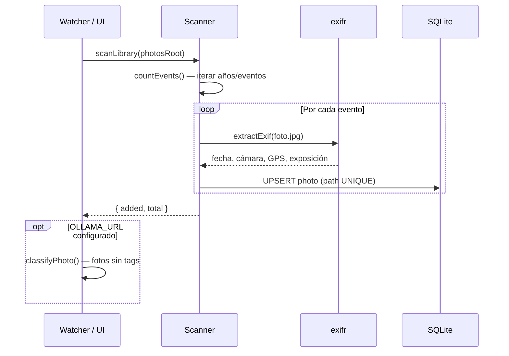

# Arquitectura del sistema

## Visión general

photoshelf es una aplicación web **monolítica** construida con Next.js 14 App Router. El servidor sirve tanto la interfaz de usuario (React Server Components + Client Components) como la API REST. No hay servicios separados — todo corre en un único proceso Node.js.



## Capas de la aplicación

### 1. Presentación (UI)

- **Server Components**: cargan datos directamente de SQLite en el servidor, renderizan HTML inicial
- **Client Components**: interactividad (formularios, modales, zoom, mapa)
- **API Routes**: endpoints REST para operaciones desde el cliente

### 2. Lógica de negocio

- **`scanner.ts`**: recorre el filesystem, extrae EXIF y sincroniza la base de datos
- **`thumbnail.ts`**: genera y cachea miniaturas WebP con sharp
- **`folderWatcher.ts`**: monitorización de carpetas nuevas, debounce, auto-scan y auto-classify
- **`ollama.ts`**: cliente para classify, review, search y generación de proyectos
- **`session.ts`**: autenticación con iron-session

### 3. Datos

- **SQLite** (better-sqlite3): base de datos embebida, WAL mode, claves foráneas activadas
- **Disco**: fotos originales en `/photos`, thumbnails cacheados en `/data/.cache`

## Flujo de petición típico



## Proceso de escaneo



## Gestión de estado del servidor

Para operaciones asíncronas de larga duración (escaneo, clasificación), el servidor usa **módulos singleton** con estado en memoria:

```
scanState.ts      → { running, done, total, currentEvent, error }
classifyState.ts  → { running, done, total, year, error }
watcherState.ts   → { enabled, watching, classifying, classifyDone, classifyTotal }
```

El cliente hace polling cada 2 segundos a `/api/scan/status` y `/api/watcher/status` para mostrar el progreso en el toast.

## Startup

`src/instrumentation.ts` (hook de Next.js) inicia el `folderWatcher` al arrancar el servidor Node.js, antes de servir cualquier petición.
