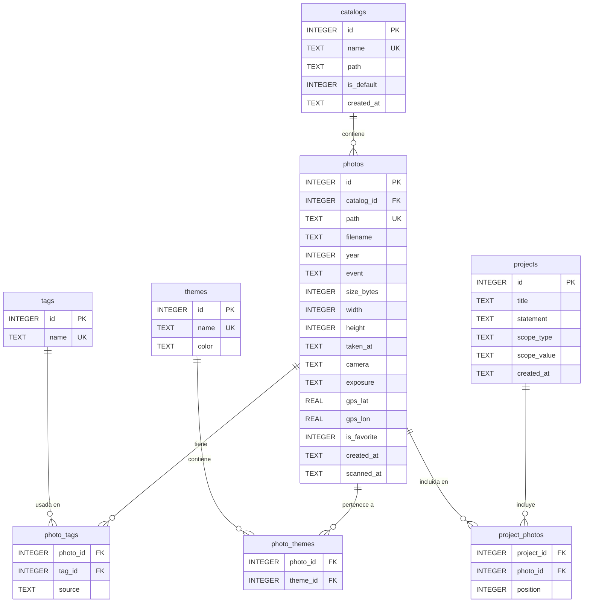

# Base de datos

photoshelf usa **SQLite** a través de `better-sqlite3`. La base de datos se crea automáticamente en `data/photoshelf.db` (o en la ruta configurada por `DB_PATH`).

## Configuración

- **WAL mode** (`journal_mode = WAL`): lecturas concurrentes sin bloquear escrituras
- **Foreign keys** activadas (`foreign_keys = ON`)
- El esquema se inicializa automáticamente con `CREATE TABLE IF NOT EXISTS` al arrancar

## Diagrama entidad-relación



## Tablas

### `catalogs`
Bibliotecas de fotos independientes. Añadida en EPIC-001.

| Columna | Tipo | Descripción |
|---|---|---|
| `id` | INTEGER PK | Auto-incremental |
| `name` | TEXT UNIQUE | Nombre del catálogo (e.g. "Fotos personales") |
| `path` | TEXT | Ruta del directorio de fotos en el host |
| `is_default` | INTEGER | 0/1 — catálogo seleccionado por defecto |
| `created_at` | TEXT | Fecha de creación |

### `photos`
Tabla principal. Cada fila es una foto escaneada, asociada a un catálogo.

| Columna | Tipo | Descripción |
|---|---|---|
| `id` | INTEGER PK | Auto-incremental |
| `catalog_id` | INTEGER FK → catalogs | Catálogo al que pertenece |
| `path` | TEXT UNIQUE | Ruta relativa al directorio del catálogo |
| `filename` | TEXT | Nombre del archivo |
| `year` | INTEGER | Año extraído de la ruta |
| `event` | TEXT | Nombre de la carpeta de evento |
| `size_bytes` | INTEGER | Tamaño en bytes |
| `width` / `height` | INTEGER | Dimensiones en píxeles (de EXIF) |
| `taken_at` | TEXT | Fecha ISO de captura (de EXIF) |
| `camera` | TEXT | Make + Model de la cámara (de EXIF) |
| `exposure` | TEXT | Velocidad · apertura · ISO (de EXIF) |
| `gps_lat` / `gps_lon` | REAL | Coordenadas GPS (de EXIF) |
| `is_favorite` | INTEGER | 0/1 — favorita |
| `created_at` | TEXT | Primera vez que se escaneó |
| `scanned_at` | TEXT | Última vez escaneada |

### `tags`
Catálogo de tags normalizados.

| Columna | Tipo | Descripción |
|---|---|---|
| `id` | INTEGER PK | |
| `name` | TEXT UNIQUE COLLATE NOCASE | Nombre en minúsculas |

### `photo_tags`
Relación N:M entre fotos y tags.

| Columna | Tipo | Descripción |
|---|---|---|
| `photo_id` | FK → photos | |
| `tag_id` | FK → tags | |
| `source` | TEXT CHECK | `'manual'` o `'ai'` |

### `themes`
Colecciones personalizadas con color.

| Columna | Tipo | Descripción |
|---|---|---|
| `id` | INTEGER PK | |
| `name` | TEXT UNIQUE COLLATE NOCASE | |
| `color` | TEXT | Hex color, e.g. `#e8a45a` |

### `photo_themes`
Relación N:M entre fotos y temáticas.

### `projects`
Proyectos fotográficos curados.

| Columna | Tipo | Descripción |
|---|---|---|
| `id` | INTEGER PK | |
| `title` | TEXT | Título del proyecto |
| `statement` | TEXT | Texto artístico |
| `scope_type` | TEXT CHECK | `'year'`, `'event'`, `'theme'`, `'all'` |
| `scope_value` | TEXT | Valor del alcance (p.ej. `"2023"`) |

### `project_photos`
Fotos de un proyecto, con posición para el orden narrativo.

## Índices

```sql
idx_photos_catalog  ON photos(catalog_id)
idx_photos_year     ON photos(year)
idx_photos_event    ON photos(year, event)
idx_photos_fav      ON photos(is_favorite)
idx_photo_tags      ON photo_tags(photo_id)
idx_photo_tags_tag  ON photo_tags(tag_id)
idx_tags_name       ON tags(name)
idx_photo_themes_p  ON photo_themes(photo_id)
idx_photo_themes_t  ON photo_themes(theme_id)
idx_project_photos_p ON project_photos(project_id)
```

## Estrategia de upsert en el escaneo

```sql
INSERT INTO photos (catalog_id, path, ...) VALUES (...)
ON CONFLICT(path) DO UPDATE SET
  scanned_at = excluded.scanned_at,
  size_bytes  = excluded.size_bytes,
  width       = COALESCE(photos.width, excluded.width),
  ...
```

Los campos EXIF solo se actualizan si estaban vacíos (`COALESCE`), preservando correcciones manuales.

## Catálogo activo

La selección del catálogo activo se gestiona mediante la cookie de sesión `active_catalog_id`. El módulo `src/lib/catalog-context.ts` la resuelve en cada request y expone el catálogo al resto de la aplicación. Todas las queries de `src/lib/queries/` reciben el `catalogId` como parámetro.
