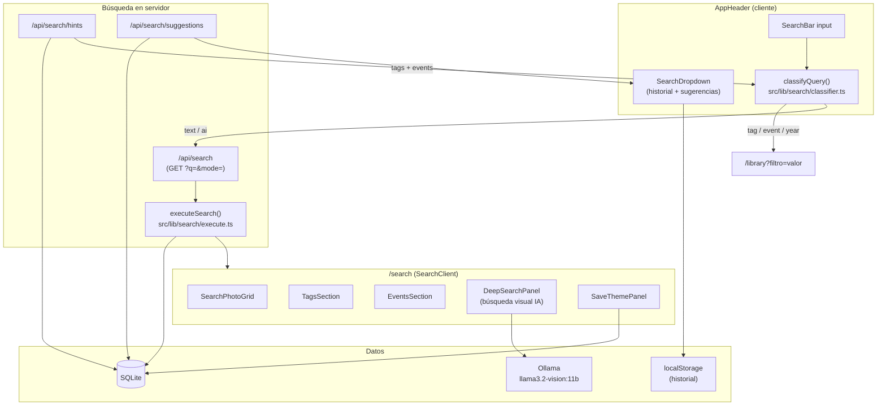
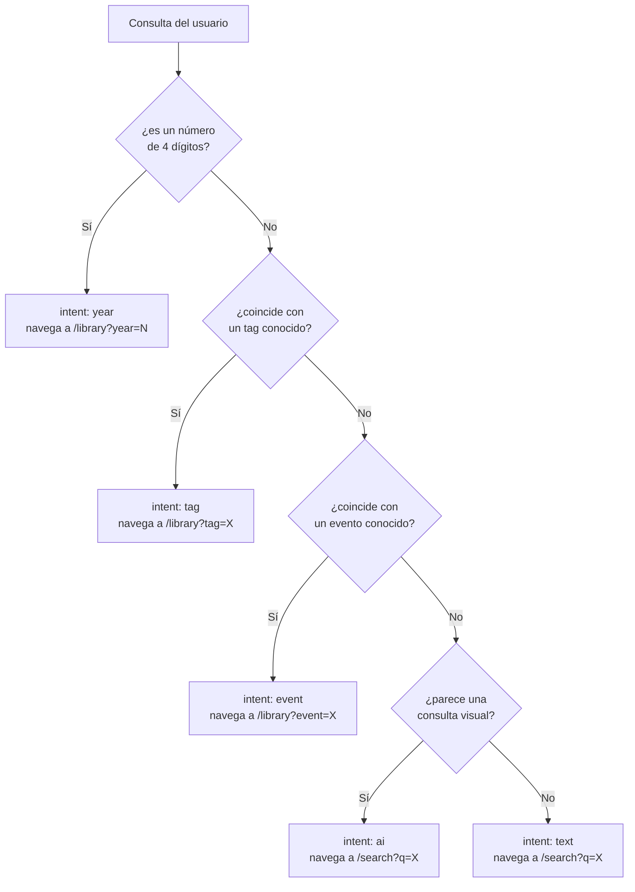
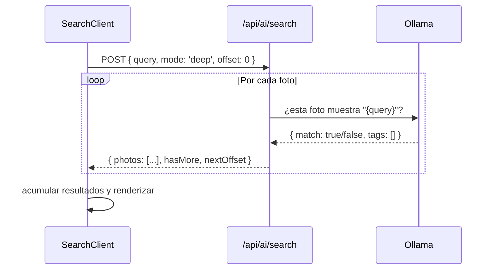

# Sistema de búsqueda (EPIC-003)

El sistema de búsqueda unificado de photoshelf (implementado en EPIC-003, US-028–034) clasifica automáticamente la intención de cada consulta y enruta al modo de procesamiento más adecuado.

## Arquitectura general



## Clasificador de intención (`src/lib/search/classifier.ts`)

El clasificador corre **en el cliente**, sin llamada al servidor. Analiza el texto con reglas locales + hints precargados:



Los **hints** (`{ tags: string[], events: string[] }`) se cargan una sola vez al montar el `AppHeader` desde `/api/search/hints` y se mantienen en memoria durante la sesión.

## Ejecutor de búsqueda (`src/lib/search/execute.ts`)

Corre en el servidor, dentro del Server Component de `/search`. Recibe la consulta y el catálogo activo y devuelve tres tipos de resultados:

| Campo | Descripción |
|---|---|
| `photos: SearchPhotoRow[]` | Fotos que coinciden (por nombre de archivo, evento o tag) |
| `tags: TagMatch[]` | Tags que contienen el texto de la consulta |
| `events: EventMatch[]` | Eventos que contienen el texto de la consulta |

## Búsqueda profunda con IA

La búsqueda profunda analiza visualmente cada foto con Ollama. Es un proceso batch que el cliente coordina directamente desde `DeepSearchPanel`:



El cliente hace llamadas sucesivas incrementando el `offset` hasta que `hasMore = false`. Los resultados se muestran en streaming conforme llegan.

## Historial y autocompletado

### Historial (`localStorage`)

- Se guarda en `photoshelf:search-history` como array JSON de strings
- Máximo 10 entradas, FIFO
- Se muestra en el `SearchDropdown` cuando el input está vacío o al enfocar

### Sugerencias (`/api/search/suggestions`)

Endpoint que devuelve tags y eventos del catálogo activo que contienen el texto escrito. Se llama con debounce de ~200 ms mientras el usuario escribe.

```json
{
  "tags": ["b&w", "blanco y negro"],
  "events": ["Boda Julia y Marc", "Black Friday 2023"]
}
```

## Sincronización header ↔ página de resultados

La página `/search` y el `AppHeader` deben mostrar siempre el mismo texto. La sincronización se hace con un **Custom Event del DOM** (sin estado global):

```
SearchClient monta → dispara photoshelf:search-sync con el ?q= actual
AppHeader escucha el evento → actualiza el texto del input
```

Esto permite que el input del header refleje la consulta activa aunque el usuario haya navegado directamente a `/search?q=xyz`.

## Componentes involucrados

| Componente | Responsabilidad |
|---|---|
| `AppHeader.tsx` | Input, clasificador, historial, navegación |
| `SearchDropdown.tsx` | Overlay de sugerencias e historial |
| `HeaderSlot.tsx` | Portal para inyectar controles de página en el header |
| `src/app/search/page.tsx` | Server Component: ejecuta `executeSearch`, pasa result |
| `src/app/search/SearchClient.tsx` | Renderiza resultados, gestiona búsqueda profunda y guardado |
| `src/lib/search/classifier.ts` | Clasificador de intención (cliente) |
| `src/lib/search/execute.ts` | Ejecutor de búsqueda (servidor) |

## Hooks de soporte

| Hook | Propósito |
|---|---|
| `useSearchHistory` | Lee/escribe historial en localStorage |
| `useSearchShortcut` | Escucha `/` y enfoca el input del header |
